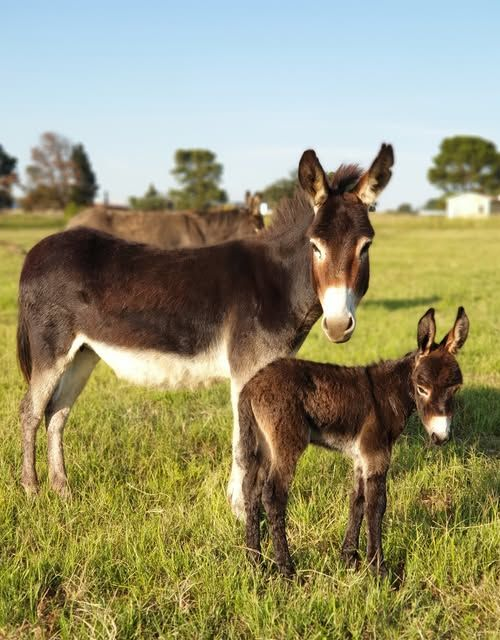

# Equinox Jam
Ogni anno ci sono 2 date in cui la durata del giorno e della notte sono in perfetto equilibrio, in cui gli opposti in eterno conflitto si fermano ad assaporare una quiete riflessiva, nella pienezza matura di un ciclo compiuto carica di concentrazione in vista una nuova stagione.  

Quei giorni si chiamano **Equinozi**, non perché i nostri amici quadrupedi amino concedersi una pausa in pieno relax, ma perché la notte dura esattamente quanto il giorno.

Il fenomeno astronomico mi ha ispirato l'idea di un incontro tra persone che hanno cose da dire e da ascoltare in modo aperto e informale.
Un incontro a tema, in cui tesi si contrappongono,si confrontano, si ibridano.
Un'*unconference* anomala, che si basa sul diritto-dovere di arrivare preparati, lasciando tuttavia piena libertà di auto-organizzazione. 

## Equinozio d'Autunno 2026